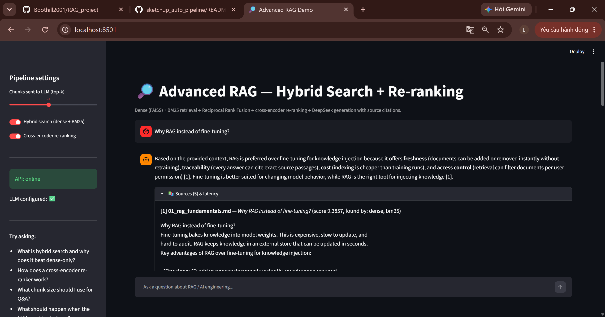
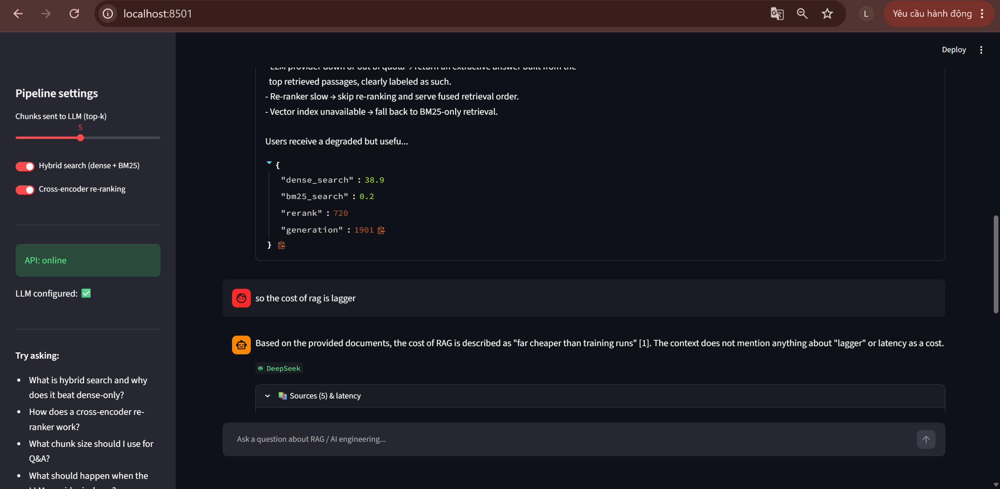

# Advanced RAG — Hybrid Search + Cross-Encoder Re-ranking

A production-style **Retrieval-Augmented Generation** pipeline demonstrating the
retrieval techniques used in enterprise RAG systems: **semantic chunking**, **hybrid
search** (dense + BM25 with Reciprocal Rank Fusion), **cross-encoder re-ranking**,
grounded generation with **source citations**, and **graceful degradation** when the
LLM provider is unavailable.

Served through a **FastAPI** backend and a **Streamlit** chat UI.

## Demo

Grounded answer with inline source citations — every claim traces back to a document:



Source inspection and per-stage latency (which retriever found each chunk, timing per
pipeline stage) — and the model correctly refusing to invent facts not in the context:



## Architecture

```
                        ┌──────────────── OFFLINE (build_index.py) ───────────────┐
  data/docs/*.md ──► semantic chunking ──► sentence-transformers ──► FAISS index   │
                     (heading/paragraph)    (all-MiniLM-L6-v2)       + BM25 corpus │
                        └──────────────────────────────────────────────────────────┘

                        ┌──────────────── ONLINE (per query) ─────────────────────┐
                        │                                                          │
   question ──┬──► dense search (FAISS, cosine, top-20) ──┐                        │
              │                                           ├─► Reciprocal Rank      │
              └──► sparse search (BM25, top-20) ──────────┘   Fusion (k=60)        │
                                                                   │               │
                                                    cross-encoder re-ranking       │
                                                 (ms-marco-MiniLM-L-6-v2)          │
                                                                   │               │
                                                             top-5 chunks          │
                                                                   │               │
                     grounded prompt (cite sources, refuse if unknown)             │
                                                                   │               │
                        DeepSeek LLM ──── on failure ───► extractive fallback      │
                        └──────────────────────────────────────────────────────────┘
```

## Features

| Feature | Implementation |
|---|---|
| Semantic chunking | Markdown heading/paragraph boundaries + size cap + overlap (`src/rag/chunking.py`) |
| Dense retrieval | `all-MiniLM-L6-v2` embeddings, FAISS `IndexFlatIP` cosine search (`vectorstore.py`) |
| Sparse retrieval | BM25 (`rank_bm25`) over tokenized chunks (`retrieval.py`) |
| Fusion | Reciprocal Rank Fusion, k=60 |
| Re-ranking | Cross-encoder `ms-marco-MiniLM-L-6-v2`, top-20 → top-5 |
| Generation | DeepSeek (`deepseek-chat`) via OpenAI-compatible SDK, grounding prompt with inline citations |
| Graceful degradation | No key / provider error → extractive answer from top passages (demo never dies) |
| API | FastAPI, async endpoint, Pydantic schemas, `/health`, Swagger at `/docs` |
| UI | Streamlit chat with per-stage latency and source inspection |
| Evaluation | Hit-rate@3 ablation: dense-only vs hybrid vs hybrid+rerank (`scripts/evaluate.py`) |

## Retrieval evaluation (ablation)

Measured over a 16-question test set against the bundled knowledge base
(`python scripts/evaluate.py`):

| Configuration | Hit-rate@3 | MRR@3 |
|---|---|---|
| Dense-only (FAISS) | 93.8% | 0.938 |
| Hybrid (dense + BM25, RRF) | **100.0%** | **1.000** |
| Hybrid + cross-encoder re-ranking | **100.0%** | 0.969 |

Hybrid fusion recovers the questions dense retrieval misses. On this small corpus
(43 chunks) hybrid already saturates the metric, so the re-ranker cannot add headroom —
its value grows with corpus size, where first-stage rankings get noisier. The ablation
harness is exactly how you'd demonstrate that on a production corpus.

Measured warm-request latency on CPU: dense search ~9 ms, BM25 <1 ms,
cross-encoder re-rank ~380 ms, DeepSeek generation ~1-3 s.

## Quickstart

```bash
# 1. Install (Python 3.10+)
python -m venv .venv
.venv\Scripts\activate          # Windows   (Linux/macOS: source .venv/bin/activate)
pip install -r requirements.txt

# 2. Configure the LLM (optional — pipeline falls back to extractive mode without it)
copy .env.example .env          # then put your DeepSeek key in .env

# 3. Build the index
python scripts/build_index.py

# 4. Start the API
uvicorn api.main:app --port 8000

# 5. Start the UI (new terminal)
streamlit run ui/app.py
```

Or query the API directly:

```bash
curl -X POST http://localhost:8000/ask \
  -H "Content-Type: application/json" \
  -d '{"question": "Why does hybrid search beat dense-only retrieval?"}'
```

Response shape:

```json
{
  "question": "...",
  "answer": "Hybrid search combines ... [1][2]",
  "mode": "llm",
  "sources": [{"chunk_id": 12, "source": "03_hybrid_search.md", "section": "...", "score": 8.1, "retrievers": ["dense", "bm25"], "text": "..."}],
  "timings_ms": {"dense_search": 25.0, "bm25_search": 1.2, "rerank": 180.0, "generation": 2100.0}
}
```

## Project layout

```
data/docs/        # knowledge base (8 English docs on RAG / AI engineering)
src/rag/          # the pipeline: config, chunking, embeddings, vectorstore,
                  # retrieval (hybrid + rerank), generation, pipeline
scripts/          # build_index.py, evaluate.py
api/              # FastAPI app
ui/               # Streamlit chat UI
```

## Design decisions

- **Why hybrid?** Dense embeddings miss exact tokens (codes, acronyms); BM25 misses
  paraphrases. RRF fuses both by rank, immune to score-scale mismatch.
- **Why re-rank?** A cross-encoder attends across query & passage jointly — far more
  accurate than bi-encoder similarity, affordable when applied to only ~20 candidates.
- **Why local embeddings?** Zero cost, no network dependency, reproducible demo.
  Swapping to OpenAI/Cohere embeddings is a one-line change in `config.py`.
- **Why extractive fallback?** Production services degrade, they don't 500. If the LLM
  is down or out of quota, the API still returns the top passages, clearly labeled.

## Author

**Nguyen Minh Tri** — Senior AI Engineer (GenAI / LLM applications)
📧 minhtri.cm2001@gmail.com
